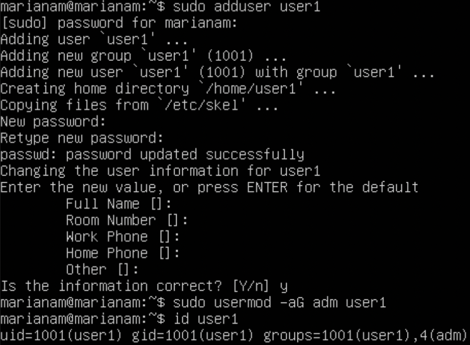

## Part 1. Установка ОС

1. Узнать версию Ubuntu 20.04 при помощи команды cat /etc/issue

## Part 2. Создание пользователя

1. Создать пользователя можно при помощи команды: sudo adduser и добавить его в группу adm при помощи команды: sudo usermod -aG user1

2. Скрин команды cat /etc/passwd

## Part 3. Настройка сети ОС

1. Задать название машины вида user-1
    - Проверить при помощи команды cat /etc/hostname user-1

2. Установить временную зону, соответствующую твоему текущему местоположению
    - Результат установки временной зоны при команды: timedatectl

3. Выведи названия сетевых интерфейсов с помощью консольной команды
    - для этого нужно установить утилиту net-tools при помощи команды: sudo apt install net-tools
    - для просмотра сетевой конфигурации: ifconfig

    - Объяснение интерфейса **lo:
    Интерфейс lo (Loopback) используется для обратной связи с устройством. Он является внутренним интерфейсом, не имеющим физического соединения, и используется для обращения к устройству самому себе. Посмотреть привязку можно в файле  /etc/hosts. Также у него есть dns-имя - localhost.**

4. Используя консольную команду, получи ip адрес устройства, на котором ты работаешь, от DHCP сервера.

    - для того чтобы сбросить ip нужна команда: sudo dhclient -r enp0s3
    - для того чтобы получить новый ip: sudo dhclient -v enp0s3
    
    - DHCP - предоставляет IP адреса компьютерам и различным устройствам сети.
    - **DHCP (Dynamic Host Configuration Protocol) - протокол для автоматической конфигурации сетевых параметров, таких как IP-адрес, шлюз, DNS. DHCP позволяет значительно уменьшить затраченное время на настройку сети, так же позволяет подключать клиента по сетям без изменения сетевых параметров.**

5. Определи и выведи на экран внешний ip-адрес шлюза (ip) и внутренний IP-адрес шлюза, он же ip-адрес по умолчанию (gw)

    - чтобы узнать ip внешний адрес и получить внутренний ip команды на скрине соответсвенно
     

6. Задай статичные (заданные вручную, а не полученные от DHCP сервера) настройки ip, gw, dns (используй публичный DNS серверы, например 1.1.1.1 или 8.8.8.8)

    - чтобы задать статичные настройки нужно отредактировать файл 00-installer-config.yaml нужно написать команду nano в терминале и до редактирования имеет вид

    
    - после редактирования

    
    
    - чтобы применить все изменения нужна команда sudo netplan try и ifconfig  для просмотра сетевой конфигурации

    

7. Перезагрузить виртуальную машину. Убедись, что статичные сетевые настройки (ip, gw, dns) соответствуют заданным в предыдущем пункте.

    - перезагрузка виртуальной машины происходит при помощи команды: sudo reboot, для проверки ip, есть команда: ip route
    - пропинговал при помощи команды ping и получил в выводе фразу «0% packet loss»
    

## Part 4. Обновление ОС

1. Обновить системные пакеты до последней на момент выполнения задания версии
    - обновление списка пакетов

    - обновление версии пакетов
    

    - повторно ввожу команду, чтобы проверить что обновления отсутсвуют
    

## Part 5. Использование команды sudo

1. Разреши пользователю, созданному в Part 2,выполнять команду sudo

    - в папке  /etc/sudoers.d создадим файл произвольный и далее откроем этот файл при помощи nano
    
    - в этот ранее созданный файл внесем содержимое
    
    - **Команда sudo в UNIX-подобных системах предоставялет временные привелегии суперпользователя(root) для выполнения команд, которые требуют повышенных прав доступа. Правила, используемые sudo для принятия решения о предоставлении доступа, находятся в файле /etc/sudoers (для редактирования файла можно использовать специальный редактор visudo, запускаемый из командной строки без параметров, в том числе без указания пути к файлу); язык их написания и примеры использования подробно изложены в man sudoers).**
    - изменить hostname OS 
    
    - и перезагрузим машину для применения изменений

## Part 6. Установка и настройка службы времени

1. Настроить службу автоматической синхронизации времени.

    - установить утилиту ntpd при помощи команды: sudo apt install ntp
    - проверим статус установки ntp: dpkg -l | grep "ntp"
    
    - проверка подключения к серверам синхронизации временем
    
    - запуск ntp при помощи команды: sudo systemctl start ntp, синхронизация времени при помощи команды: sudo ntpd -gq
    
    - вывод следующей команды должен содержать NTPSynchronized=yes: 
    
    - вывел время часового пояса, в котором нахожусь
    

## Part 7. Установка и использование текстовых редакторов

1. Установи текстовые редакторы VIM (+ любые два по желанию NANO, MCEDIT, JOE и т.д.)

Используя каждый из трех выбранных редакторов, создай файл test_X.txt, где X -- название редактора, в котором создан файл. Напиши в нём свой никнейм, закрой файл с сохранением изменений.
- редактирую файл test_vim.txt
    
    - для выхода использую команду :wq Enter 
    - редактирую файл test_nano.txt
    
    - для выхода с изменениями использую Ctrl + x + y Enter
    - устанавливаю редактор JOE при помощи команды: sudo apt install joe и редактирую его
    
    - для выхода с сохранением использую Ctrl + K + X

2. Используя каждый из трех выбранных редакторов, открой файл на редактирование, отредактируй файл, заменив никнейм на строку «21 School 21», закрой файл без сохранения изменений.

- редактирование файла test_vim.txt

для выхода без сохранения изменений нужно ввести: :q! и Enter
- редактирование файла test_nano.txt

для выхода без сохранений нужно нажать Ctrl + x затем N
- редактирование файла test_joe.txt

для выхода без сохранений нажимаю Esc и в окне выбираю No и Enter

3.Используя каждый из трех выбранных редакторов, отредактируй файл ещё раз (по аналогии с предыдущим пунктом), а затем освой функции поиска по содержимому файла (слово) и замены слова на любое другое.
- результаты поиска в Виме

для поиска ввел / и ввел нужную строку
- результаты поиска в Nano

для поиска в Nano нужна комбинация клавиш Ctrl + w ввести нужную строку и Enter
- результаты поиска в joe 

для поиска в joe нужно нажать комбинацию клавиш Ctrl + k + f, после нажать Enter
3. Используя каждый из трех выбранных редакторов, отредактируй файл ещё раз (по аналогии с предыдущим пунктом), а затем освой функции поиска по содержимому файла (слово) и замены слова на любое другое
- замена слова на любое другое в Виме

для замены ввел команду :s/anam/mana
- замена слова на любое другое в Nano

для замены ввел команду Ctrl + \  дальше вводим искомую строку и Enter
- замена слова на любое другое в joe

для замены ввел команду Ctrl + K + f, дальше ввел строку anam и нажал Enter. Дальше ввел r(replace) ввел нужную замену и нажал Enter

## Part 8. Part 8. Установка и базовая настройка сервиса SSHD

1. Установить службу SSHd
- установить ssh-сервер

2. Добавить автостарт службы при загрузке системы
- 
3. Перенастроить службу SSHd на порт 2022
- для того чтобы перенастроить на порт 2022 нужно открыть файл при помощи sudo nano /etc/ssh/sshd_config
- находим строку Port меняем ее на порт 2022

- теперь нам нужно перезапустить SSHD при помощи команды: sudo service sshd restart и проверить ее статус

4. Используя команду ps, покажи наличие процесса sshd. Для этого к команде нужно подобрать ключи
- для этого существует команда ps -C sshd

- Утилита ps - это встроенная программа для Unix-подобных систем. С ее помощью осуществляется моониторинг активных проессов в файловой системе /proc.
Ключи команды ps:

- -A, -e - выбрать все процессы
-    -a - выбрать все процессы, кроме фоновых
-    -d - выбрать все процессы, даже фоновые, кроме процессов сессий
-    -N - выбрать все процессы кроме указанных
-    -С - выбирать процессы по имени команды
-    -G - выбрать процессы по ID группы
-    -p - выбрать процессы PID
-    --ppid - выбрать процессы по PID родительского процесса
-    -s - выбрать процессы по ID сессии
-    -t - выбрать процессы по tty
-    -u - выбрать процессы пользователя
-    -x - найти все вхождения строки поиска

Опции форматирования как пример:

-    -с - отображать информацию планировщика
-    -f - вывести максимум доступных данных, например, количество потоков
-    -F - аналогично -f, только выводит ещё больше данных
-    -l - длинный формат вывода
-    -j - вывести процессы в стиле Jobs, минимум информации
-    -M - добавить информацию о безопасности

5. Перезагрузить систему
- для перезапуска команда sudo reboot
- скачал утилиту netstat применив команду sudo apt insall net-tools

- Обьяснение значение ключей -tan, значения каждого столбца вывода, значения 0.0.0.0.:
- -t - Отображение текущего подключения в состоянии переноса нагрузки с процессора на сетевой адаптер при передаче данных.
- -a - Отображение всех подключений и ожидающих портов.
- -n - Отображение адресов и номеров портов в числовом формате.
 - **Адрес 0.0.0.0. означает "любой IP данного компьютера", этот адрес означает что IP еще не настроен. IP-адрес 0.0.0.0 используется во время инициализации системы, когда устройство использует его до того, как ему будет назначен реальный IP-адрес.**

9. Part 9. Установка и использование утилит top, htop
- запуск утлиты top

- uptime - 15 min
- кол-во авторизованных юзеров - 1
- общая загрузка системы - 0, 0, 0
- общее кол-во процессов - 92
- загрузка cpu - 0%
- загрузка памяти - 144Mib
- pid процесса занимающего больше всего памяти - 1
- pid процесса, занимающего больше всего процессорного времени - 1416
- Вывод команды htop

- Сортировка по PID

- Сортировка по PERCENT_CPU

- Сортировка по PERCENT_MEM

- Сортировка по TIME

- Отфильтрованный процесс sshd

- Процесс syslog, найденный используя поиск

- Отображение с добавленным выводом hostname, clock и uptime

## Part 10. Использование утилиты fdisk

Запустить команду fdisk -l

- название жесткого диска - /dev/sda
- размер жесткого диска - 10Gib
- количество секторов - 20971520
- размер swap(команда sudo swapon --show) - 0

## Part 11. Использование утилиты df
1. Запустить команду df при помощи команды sudo df

- размер раздела - 8408452
- размер занятого пространства - 2566980
- размер свободного пространства - 5392756
- процент использования - 33%
- единица измерения в выводе - Кб
2. Запустить команду df -Th.

- размер раздела - 8.1G
- размер занятого пространства - 2.5G
- размер свободного пространства - 5.2G
- процент использования - 33%
- тип файловой системы для раздела - ext4.

## Part 12. Использование утилиты du
1. Запустить команду du
2. Вывести размер папок /home /var

- Вывести размер папок /var/log

3. Вывести размер всего содержимого в /var/log (не общее, а каждого вложенного элемента, используя *)

## Part 13. Установка и использование утилиты ncdu
1. Установи утилиту ncdu

2. Выведи размер папок /home, /var, /var/log, вывожу размеры данных команд соответсвенно 

- 
- 

## Part 14. Работа с системными журналами
1. Открой для просмотра: /var/log/dmesg

- Открой для просмотра: /var/log/syslog

- Открой для просмотра: /var/log/auth.log
- время последней успешной авторизации - 14:27:05, имя пользователя - marianam, метод входа в систему - LOGIN

- Перезапусти службу SSHd - sudo service sshd restart
- скрин с сообщением о рестарте службы - comand sudo grep -a restart /var/log/auth.log

## Part 15. Использование планировщика заданий CRON
1. Используя планировщик заданий, запусти команду uptime через каждые 2 минуты.
- Создать задачу в планировщике с помощью команды: crontab -e

- проверка выполнения задания планировщиком при помощи команды: tail -f /var/log/syslog

2. Удали все задания из планировщика заданий
- удаление добавленного задания производится при помощи команды: crontab -e 

 

